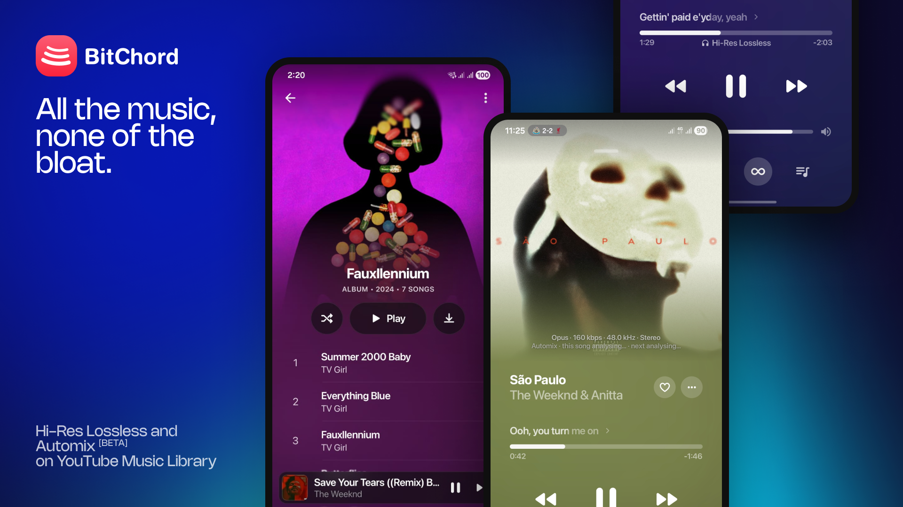

 
 

# TuneHive

### Aesthetic YouTube Music & Hi-Res Lossless Audio Client

 

 

[**Download**](#download) · [**Features**](#features) · [**Disclaimer**](#disclaimer)

> [!WARNING]
> TuneHive is an independent client not affiliated with, endorsed by, or connected to YouTube or Google.

---

<h1>Features</h1>

<table>
  <tr>
    <td width="50%" valign="top">

#### Playback & Audio
- **Search, browse and play** anything available on YouTube Music.
- **Hi-Res Lossless Audio** — FLAC/ALAC from configured module sources with YouTube Music fallback.
- **Gapless playback with true crossfade**, adjustable 0–12s.
- **On-Device Automix** — DJ-style transitions with beat-matching, tempo-stretching, and vocal spectrogram separation.
- **Offline Downloads** — save tracks with embedded metadata and artwork.
- **Local music library** integration.
- **Background playback** via foreground media session.

#### Experience
- **Animated album canvas** — motion artwork on the now-playing screen.
- **Word-synced lyrics** — word/syllable-level highlighting from multiple sources.
- **Dynamic, artwork-driven theming** — fluid mesh palette extracted from album art.
- **Frosted-glass UI** — Telegram-style translucent bars via Haze and Material 3 theming.

    </td>
    <td width="50%" valign="top">

#### Connectivity & Accounts
- **Sign in with your Google account** for personalized content.
- **Discord Rich Presence** — live track/artist/album and progress updates.
- **Scrobbling** to Last.fm and ListenBrainz.
- **Pluggable sources** — add, edit, test, and health-check module sources.

#### Controls & Tweaks
- **Per-network audio quality** — separate quality ceilings for Wi-Fi and mobile data.
- **Playback speed control** (0.5×–2.0×) and **skip silence**.
- **Sleep timer** — fixed presets or "stop after this track".
- **Home Screen Widgets** — responsive 2x2 and 4x2 widgets.
- **Stats for nerds** — codec, bit depth, sample rate, and streaming details.

    </td>
  </tr>
</table>

---

<h1>Download</h1>

Grab the latest signed or release APK from the [Releases](https://github.com/santjsx/music-palyer/releases) page. Sideloading requires enabling "Install unknown apps" for whichever app you download it with.

---

<h1>Disclaimer & Legal Notice</h1>

TuneHive is an independent, community-driven third-party audio player and client. It is **not** associated with Google LLC, YouTube Music, Deezer, Telegram, or any of their parent companies.

* **No Media Hosting:** TuneHive does not host, upload, or store copyrighted music files. It operates strictly as an interface to scan local device storage or stream media directly from public, public-facing, or user-authenticated APIs.
* **Fair Use & API Usage:** This software is created solely for personal research, educational, and fair-use purposes.
* **Copyleft:** TuneHive is free software licensed under the **GNU General Public License v3.0 (GPLv3)**.

